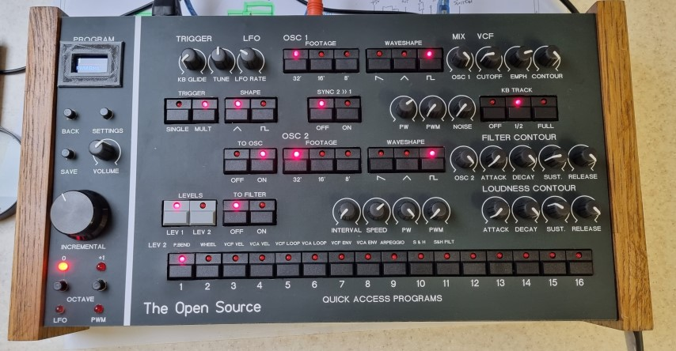

# Moog-Source-clone

Teensy 3.6 Moog Source based mono synth with MIDI and USBhost
This synth was inspired by the Moog Source of the 80's.
CEM chips for the VCO's as I dont have an autotune routine.
All control CV's are generated by 13 MCP4822 dual DACs, the main CV and velocity comes from the Teensy DAC.
The filter is a classic Moog ladder from the Memory Moog using AS3046 and transistors.
LFO's, VCF and VCA env gens are all Electric Druid chips 
VCAs are AS3364 quad VCA chips for the levels etc.
Buttons are PB86-B1 in back from AliExpress
PSU is a MeanWell RQ50-C quad PSU with +/-15 and +/- 5V supplies.

I'm revisiting this project and adding more functions. So far I've updated the code for.

* Arpeggiator 24 notes similar to original source in operation
* 2x 64 note step sequencers
* Sequencers stored to each patch

How it sounds  https://youtu.be/6hMTac6jpIQ

